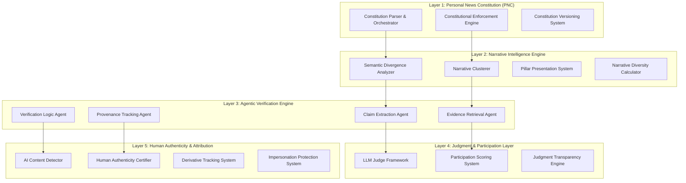

# Design Document: EthosNews - Intent-Driven Participatory News Intelligence Platform

## Overview

EthosNews is a sophisticated GenAI-orchestrated platform that addresses systemic failures in modern media ecosystems through a five-layer architecture. The system enables users to define explicit epistemic preferences via Personal News Constitutions (PNC), surfaces competing narrative perspectives through semantic divergence clustering, and performs real-time multi-agent fact-checking with comprehensive provenance tracking.

The platform serves multiple user personas - general consumers seeking agency and news literacy, journalists requiring rapid verification and narrative context, fact-checkers needing scalable infrastructure, and content creators seeking authenticity protection - while prioritizing epistemic merit over engagement metrics through LLM-as-a-Judge evaluation frameworks.

## Architecture

The system employs a layered GenAI architecture where each layer builds upon the previous ones:



### Layer Interactions

- **Layer 1 (PNC)** conditions all downstream behavior through constitutional parameters
- **Layer 2 (Narrative Intelligence)** uses constitutional diversity requirements to guide clustering
- **Layer 3 (Agentic Verification)** applies constitutional verification standards and time limits
- **Layer 4 (Judgment & Participation)** evaluates content against constitutional epistemic criteria
- **Layer 5 (Human Authenticity)** enforces constitutional transparency and attribution requirements

## Components and Interfaces

### Personal News Constitution (PNC) Layer

**Constitution Parser**
- **Input**: Natural language epistemic preferences from users
- **Processing**: LLM-based semantic analysis to extract structured parameters
- **Output**: Structured constitutional parameters (verification standards, diversity requirements, bias controls, content constraints)
- **Interface**: `parseConstitution(naturalLanguageText: string) -> ConstitutionalParameters`

**Constitutional Enforcement Engine**
- **Input**: Constitutional parameters, content recommendations, system decisions
- **Processing**: Real-time validation of all system behavior against user preferences
- **Output**: Filtered and prioritized content aligned with constitutional requirements
- **Interface**: `enforceConstitution(content: Content[], parameters: ConstitutionalParameters) -> FilteredContent[]`

### Narrative Intelligence Engine

**Semantic Divergence Analyzer**
- **Input**: News articles about similar events, constitutional diversity requirements
- **Processing**: Vector embedding analysis to identify conceptual distance between interpretations
- **Output**: Divergence scores and perspective groupings
- **Interface**: `analyzeDivergence(articles: Article[]) -> DivergenceMatrix`

**Narrative Clusterer**
- **Input**: Articles with divergence scores, constitutional minimum diversity thresholds
- **Processing**: Clustering algorithm that maximizes semantic divergence rather than similarity
- **Output**: Distinct narrative pillars representing competing perspectives
- **Interface**: `clusterNarratives(articles: Article[], divergenceMatrix: DivergenceMatrix) -> NarrativePillar[]`

### Agentic Verification Engine

**Claim Extraction Agent**
- **Input**: News articles, constitutional verification scope
- **Processing**: NLP-based identification of verifiable factual claims
- **Output**: Structured claims with confidence scores and verification priority
- **Interface**: `extractClaims(article: Article) -> VerifiableClaim[]`

**Evidence Retrieval Agent**
- **Input**: Verifiable claims, constitutional source requirements
- **Processing**: Multi-source search across authoritative databases, official sources, and scholarly publications
- **Output**: Relevant evidence with source credibility assessments
- **Interface**: `retrieveEvidence(claim: VerifiableClaim) -> Evidence[]`

**Verification Logic Agent**
- **Input**: Claims and evidence, constitutional verification standards
- **Processing**: Logical reasoning to assess claim accuracy using evidence
- **Output**: Verification results with confidence scores and reasoning chains
- **Interface**: `verifyClaim(claim: VerifiableClaim, evidence: Evidence[]) -> VerificationResult`

### LLM-as-a-Judge Framework

**Epistemic Merit Evaluator**
- **Input**: Content, community contributions, constitutional quality criteria
- **Processing**: Multi-dimensional assessment using trained LLM judges
- **Output**: Quality scores with detailed explanations
- **Interface**: `evaluateEpistemicMerit(content: Content, criteria: EpistemicCriteria) -> QualityAssessment`

**Participation Scoring System**
- **Input**: User contributions, historical accuracy, constitutional merit definitions
- **Processing**: LLM-based evaluation independent of engagement metrics
- **Output**: Merit-based scores and reputation updates
- **Interface**: `scoreParticipation(contribution: UserContribution) -> ParticipationScore`

### Human Authenticity & Attribution Layer

**AI Content Detector**
- **Input**: Text, images, multimedia content
- **Processing**: Trained detection models with ensemble voting
- **Output**: AI-generation probability scores with confidence intervals
- **Interface**: `detectAIContent(content: Content) -> AIDetectionResult`

**Human Authenticity Certifier**
- **Input**: Content claimed as human-authored, verification evidence
- **Processing**: Multi-factor authentication and cryptographic signing
- **Output**: Authenticity certificates with immutable provenance
- **Interface**: `certifyHumanAuthorship(content: Content, author: User) -> AuthenticityCertificate`

## Data Models

### Core Data Structures

```typescript
interface ConstitutionalParameters {
  verificationStandards: {
    minimumSources: number;
    acceptableSourceTypes: SourceType[];
    verificationTimeLimit: Duration;
    confidenceThreshold: number;
  };
  diversityRequirements: {
    minimumPerspectives: number;
    maxSimilarityThreshold: number;
    requiredViewpointTypes: ViewpointType[];
  };
  biasControls: {
    acceptableBiasTypes: BiasType[];
    biasToleranceLevel: number;
    balancingRequirements: BalancingStrategy;
  };
  contentConstraints: {
    excludedTopics: string[];
    languagePreferences: Language[];
    contentFormats: ContentFormat[];
  };
}

interface NarrativePillar {
  id: string;
  perspective: string;
  articles: Article[];
  divergenceScore: number;
  representativeQuotes: string[];
  sourceDistribution: SourceDistribution;
  biasProfile: BiasProfile;
}

interface VerificationResult {
  claimId: string;
  accuracy: AccuracyLevel;
  confidence: number;
  reasoningChain: ReasoningStep[];
  evidenceSources: EvidenceSource[];
  verificationTimestamp: Date;
  constitutionalCompliance: boolean;
}

interface QualityAssessment {
  overallScore: number;
  epistemicDimensions: {
    factualAccuracy: number;
    sourceCredibility: number;
    reasoningTransparency: number;
    constructiveContribution: number;
  };
  explanation: string;
  improvementSuggestions: string[];
}

interface AuthenticityProfile {
  contentId: string;
  humanAuthored: boolean;
  aiGenerated: boolean;
  hybrid: boolean;
  confidence: number;
  detectionMethods: DetectionMethod[];
  certificate?: AuthenticityCertificate;
}
```

### Database Schema

**Users Table**
- `user_id`, `constitution_parameters`, `reputation_score`, `expertise_domains`, `verification_history`

**Articles Table**
- `article_id`, `content`, `source`, `publication_date`, `narrative_pillar_id`, `verification_status`

**Claims Table**
- `claim_id`, `article_id`, `claim_text`, `verification_result`, `evidence_sources`, `confidence_score`

**Narrative Pillars Table**
- `pillar_id`, `topic_id`, `perspective_summary`, `divergence_score`, `article_count`, `source_diversity`

**Verification Results Table**
- `verification_id`, `claim_id`, `agent_results`, `reasoning_chain`, `provenance_data`, `timestamp`

## Correctness Properties

*A property is a characteristic or behavior that should hold true across all valid executions of a system-essentially, a formal statement about what the system should do. Properties serve as the bridge between human-readable specifications and machine-verifiable correctness guarantees.*

Now I need to analyze the acceptance criteria from the requirements to determine which ones can be tested as properties.

### Property 1: Constitutional Management Round-Trip Consistency
*For any* natural language constitutional preferences, parsing then enforcing then retrieving constitutional parameters should preserve the user's original epistemic intent and produce consistent system behavior across all platform layers.
**Validates: Requirements 1.1, 1.2, 1.4, 1.5**

### Property 2: Semantic Intent Understanding Completeness  
*For any* user information request, the intent parser should extract both explicit and implicit semantic concepts while correctly categorizing the request type (factual vs opinion-seeking), ensuring comprehensive understanding of user needs.
**Validates: Requirements 2.1, 2.2, 2.3**

### Property 3: Constitutional Compliance in Content Curation
*For any* parsed user intent and constitutional parameters, content curation should prioritize constitutional compliance over engagement metrics, ensuring that all delivered content aligns with user-defined epistemic preferences.
**Validates: Requirements 2.4, 2.5**

### Property 4: Semantic Divergence Clustering Effectiveness
*For any* set of news articles about the same events, narrative clustering should group articles by semantic divergence to create genuinely distinct perspective pillars, with diversity scores accurately reflecting the breadth of represented viewpoints.
**Validates: Requirements 3.1, 3.2, 3.4**

### Property 5: Constitutional Diversity Enforcement
*For any* constitutional diversity requirements and available content, the system should only deliver content when minimum perspective representation is achieved, ensuring equal prominence regardless of popularity.
**Validates: Requirements 3.3, 3.5**

### Property 6: Multi-Agent Verification Workflow Completeness
*For any* verifiable claim in news content, the agentic verification system should extract claims, deploy appropriate agents, complete verification with confidence scoring and reasoning, or properly handle timeouts with appropriate labeling.
**Validates: Requirements 4.1, 4.2, 4.3, 4.4, 4.5**

### Property 7: Comprehensive Provenance Chain Integrity
*For any* piece of information or AI decision in the system, complete provenance chains should be recorded and maintained immutably, with clear distinction between human-authored and AI-generated content.
**Validates: Requirements 5.1, 5.2, 5.4, 5.5**

### Property 8: LLM Judge Epistemic Merit Consistency
*For any* content or community contribution, LLM judges should evaluate based on epistemic criteria independent of engagement metrics, providing detailed explanations and triggering human review when judges disagree significantly.
**Validates: Requirements 6.1, 6.2, 6.3, 6.4, 6.5**

### Property 9: Merit-Based Participation Evaluation
*For any* user contribution, the evaluation system should assess quality using epistemic standards, verify proper citations and reasoning, and weight contributions based on expertise rather than social metrics.
**Validates: Requirements 7.1, 7.2, 7.3, 7.4**

### Property 10: System Responsiveness Under Load
*For any* system load condition, processing times should remain within constitutional limits (5 minutes for articles, 2 seconds for queries) through intelligent resource allocation and auto-scaling.
**Validates: Requirements 8.1, 8.2, 8.3, 8.5**

### Property 11: Bias Detection with Context Provision
*For any* news content, bias detection should identify political, cultural, and demographic biases while providing contextual information about bias nature and impact, ensuring diverse source representation when available.
**Validates: Requirements 9.1, 9.3, 9.4, 9.5**

### Property 12: Comprehensive AI Explainability
*For any* AI-driven decision in the system, explanations should be provided for all recommendations and assessments, with detailed reasoning chains available upon user request and algorithm transparency accessible through user interfaces.
**Validates: Requirements 10.1, 10.3, 10.4, 10.5**

## Error Handling

### Constitutional Conflict Resolution
- **Ambiguous Parameters**: When constitutional preferences conflict or are ambiguous, the system guides users through structured clarification processes using LLM-generated questions and examples
- **Invalid Configurations**: Semantically incoherent constitutional parameters are rejected with specific explanations and suggested corrections
- **Timeout Handling**: When constitutional enforcement cannot be completed within specified time limits, users are notified with estimated completion times

### Verification Failures
- **Source Unavailability**: When authoritative sources are inaccessible, the system uses alternative sources and adjusts confidence scores accordingly
- **Agent Failures**: If verification agents fail, backup agents are deployed and failure reasons are logged in provenance chains
- **Incomplete Evidence**: Claims with insufficient evidence are marked as "verification incomplete" with explanations of evidence gaps

### Content Processing Errors
- **Clustering Failures**: When semantic divergence analysis fails, articles are presented with warnings about incomplete perspective representation
- **AI Detection Errors**: Uncertain AI content detection results are clearly labeled with confidence intervals and detection method details
- **Judge Disagreements**: When LLM judges disagree significantly, content is escalated to human expert review with full context and disagreement analysis

### System Performance Degradation
- **Load Balancing**: Under high load, the system prioritizes constitutional compliance over response speed while maintaining minimum performance thresholds
- **Graceful Degradation**: When full verification cannot be completed in time, partial results are provided with clear indicators of completeness
- **Failover Mechanisms**: Critical system components have redundant backups to ensure continuous operation

## Testing Strategy

### Dual Testing Approach

The platform requires both unit testing and property-based testing to ensure comprehensive coverage:

**Unit Tests** focus on:
- Specific examples of constitutional parsing edge cases
- Integration points between the five system layers  
- Error conditions and timeout scenarios
- Multi-persona interface adaptations
- Specific bias detection examples with known ground truth

**Property Tests** focus on:
- Universal properties that hold across all constitutional configurations
- Semantic divergence clustering behavior across diverse content sets
- Multi-agent verification workflows with randomized claim types
- LLM judge consistency across varied content and contribution types
- System performance under varying load conditions

### Property-Based Testing Configuration

**Testing Framework**: Use Hypothesis (Python) or fast-check (TypeScript) for property-based testing
**Minimum Iterations**: 100 iterations per property test due to randomization requirements
**Test Tagging**: Each property test references its design document property using the format:
- **Feature: news-intelligence-platform, Property 1: Constitutional Management Round-Trip Consistency**

### Test Data Requirements

**Constitutional Variations**: Generate diverse constitutional parameters covering different epistemic preferences, verification standards, and diversity requirements
**Content Corpus**: Use real news articles from multiple sources with known bias profiles and factual accuracy assessments
**Multi-Agent Scenarios**: Test verification workflows with various claim types, evidence availability, and source credibility levels
**Performance Testing**: Simulate realistic load patterns with concurrent users across different personas
**Ground Truth Datasets**: Maintain verified datasets for bias detection, fact-checking accuracy, and narrative perspective validation

### Integration Testing Strategy

**Layer Integration**: Test interactions between all five system layers to ensure constitutional parameters properly condition downstream behavior
**Multi-Persona Workflows**: Validate that interface adaptations and functionality work correctly for each user persona
**Real-Time Processing**: Test end-to-end workflows from content ingestion through verification to user delivery within constitutional time limits
**Provenance Validation**: Ensure complete audit trails are maintained across all system operations and decision points